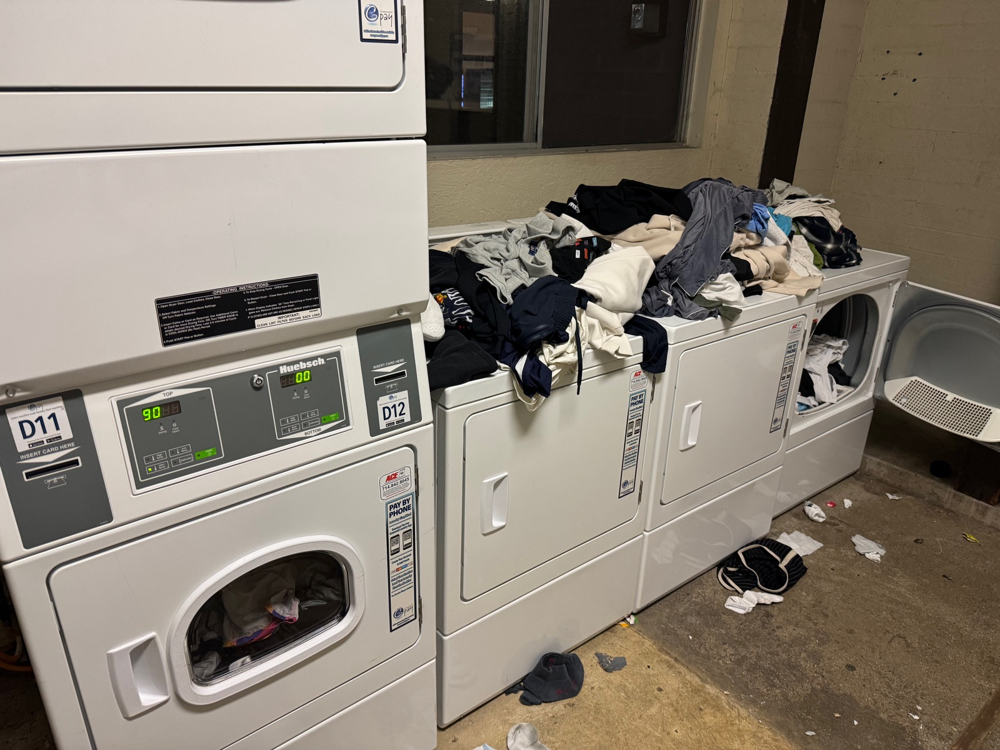

# SpinSight

[SpinSight](https://spinsight.xyz) is a dorm laundry dashboard for The Webb Schools that shows washer and dryer availability, estimated finish times, and usage history. Students can filter machines by dorm, see which machine is expected to finish next, and compare activity across weekly and daily charts.

## The problem

Dorm laundry rooms are shared spaces where timing matters. Students need to know when a machine is available and when to return for their clothes. Without that information, checking on laundry can mean repeated trips, and finished loads can remain in machines while others wait.

SpinSight helps students plan around machine availability by bringing status, estimated finish times, and usage history into one view. Students can check before heading downstairs, keep track of a running cycle, and use past activity to choose a less busy time.

## Frontend

The dashboard is built with **Svelte 5**, **TypeScript**, and **Vite**, and configured for hosting through **Cloudflare Workers static assets**. It presents availability summaries, individual machine cards, and usage charts, with light, dark, and system themes.

Machine countdowns update every second using stored completion estimates and the device clock. Progress fills show elapsed time from the latest reading toward its estimated finish, since the source data does not include cycle start times. These updates happen in the browser without additional API requests.

First-time visitors are offered a short dashboard tour. Their choice is saved in a cookie for one year. Add `?tour` to the dashboard URL to start the tour again at any time.

The weekly chart shows each day's peak running count during the previous full Monday–Sunday week in the device's local timezone. Daily charts show individual readings, with missing observations left blank. Usage hours are estimated from those readings, bounded by the next observation, the completion estimate, and the 30-minute polling interval.

## Backend

A separate **Cloudflare Worker**, written in TypeScript, retrieves machine data from Greenwald's room-view API and stores snapshots in **Cloudflare D1**. A Cron Trigger runs this process every 30 minutes. The Worker validates upstream responses and retries network failures, rate limits, and server errors with backoff, up to five attempts.

Each snapshot stores a machine's identity, location, status, type, estimated completion time, and top-off information alongside the poll timestamp. Snapshots are keyed by Bluetooth address and poll time, preserving a history of readings. Each poll is saved in one transaction so the dashboard reads complete batches.

The frontend accesses this data through two endpoints.

- `GET /v1/dashboard` returns the latest saved machine readings and history for the requested `start` and `end` timestamps, covering up to eight days.
- `POST /v1/scrape` verifies a Turnstile token, fetches fresh readings from Greenwald, and saves them to D1 before returning.

Opening the dashboard reads stored data and starts an invisible Turnstile check. Pressing Refresh calls the scraper endpoint, waits for the database write, and then reloads the dashboard. If background verification fails, a visible Turnstile challenge appears in a card. More than three refresh attempts in a rolling minute for the same browser also require a visible challenge. The Worker assigns each browser a signed cookie to count separately, including when many students share one public IP address. Greenwald credentials and database access remain in the backend Worker.

Refresh verification uses one Managed Turnstile widget. Its site key is public in the frontend; its secret belongs in the Worker secret binding `TURNSTILE_SECRET`. Apply `worker/migrations/0002_refresh_attempts.sql` to the Worker D1 database before deploying the Worker. `TURNSTILE_HOSTNAMES` in `worker/wrangler.toml` lists accepted frontend hostnames; local development needs local hostnames added in its own environment. The background widget runs with interaction-only appearance. If Cloudflare requests interaction, the dashboard waits until Refresh is clicked and then displays the widget in a card.

## Project structure

- `frontend/` contains the Svelte interface, machine cards, and chart calculations.
- `worker/` contains the API handlers, Greenwald client, scraper, database storage code, migration, and polling configuration.

Licensed under the [MIT License](LICENSE.md).
