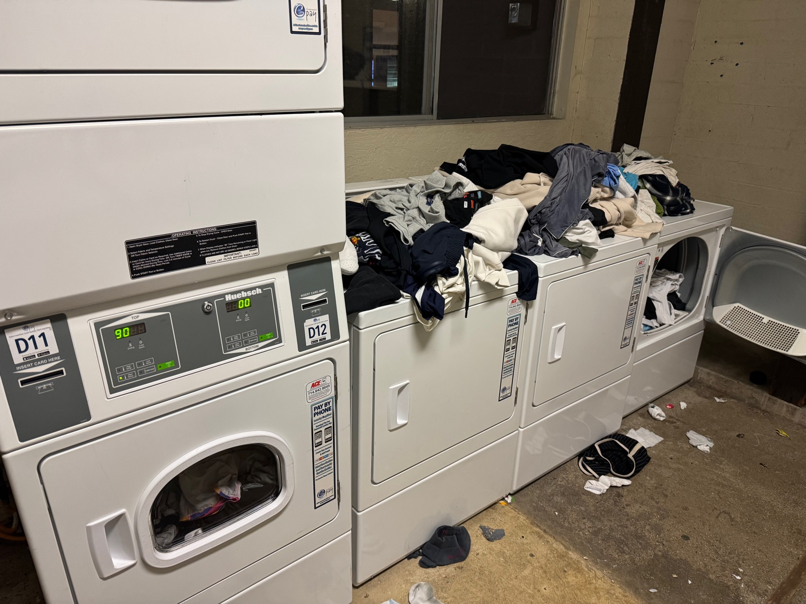

# SpinSight

[SpinSight](https://spinsight.xyz) is a dorm laundry dashboard for The Webb Schools. It shows washer and dryer availability, estimated finish times, and usage history. Students can filter machines by dorm, see which machine is expected to finish next, and compare activity across weekly and daily charts.

## The problem

Dorm laundry rooms are shared spaces where timing matters. Students need to know when a machine is available and when to return for their clothes. Without that information, checking on laundry can mean repeated trips, and finished loads can remain in machines while others wait.

SpinSight helps students plan around machine availability by bringing status, estimated finish times, and usage history into one view. Students can check before heading downstairs, keep track of a running cycle, and use past activity to choose a less busy time.

## Frontend

The dashboard is built with **Svelte 5**, **TypeScript**, and **Vite**, and configured for hosting through **Cloudflare Workers static assets**. It presents availability summaries, individual machine cards, and usage charts, with light, dark, and system themes.

The weekly chart shows each day's peak running count during the previous 7 days in the device's local timezone. Daily charts show individual readings, with missing observations left blank.

## Backend

A separate **Cloudflare Worker**, written in TypeScript, retrieves machine data from Greenwald's room-view API and stores snapshots in **Cloudflare D1**. A Cron Trigger runs this process every 30 minutes, but it can also be triggered via clicking the refresh button in the UI. The Worker validates upstream responses and retries network failures and rate limits responsibly.

Each snapshot stores a machine's identity, location, status, type, estimated completion time, and top-off information alongside the poll timestamp. Snapshots are keyed by Bluetooth address and poll time, preserving a history of readings. Each poll is saved in one transaction so the dashboard reads complete batches.

The data Worker exposes two endpoints.

- `GET /v1/dashboard` returns the latest saved machine readings and history for the requested `start` and `end` timestamps.
- `POST /v1/scrape` verifies a Turnstile token, fetches fresh readings from Greenwald, and saves them to D1.

A separate relay Worker accepts reports from the dashboard. Both endpoints verify a Turnstile token to prevent abuse.

- `POST /v1/machine-report` accepts `dorm`, `machineIds`, and `token` to submit machine IDs for machines yet assigned to dorms.
- `POST /v1/problem-report` accepts `dorm`, `description`, and `token` to report a problem. It also accepts browser `diagnostics`.

Opening the dashboard reads stored data and starts a background Turnstile check. Rate-limiting is applied. Credential secrets and database access remain in the background Worker.

## Project structure

- `frontend/` contains the Svelte interface, machine cards, and chart calculations.
- `worker/` contains the API handlers, scraper, database storage code, and polling configuration.
- `relay/` contains the report API handlers, Telegram bot, and report delivery code.

Licensed under the [MIT License](LICENSE.md).
